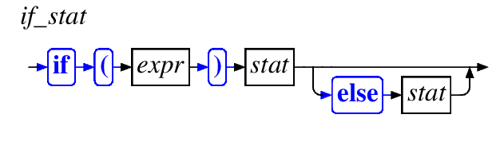
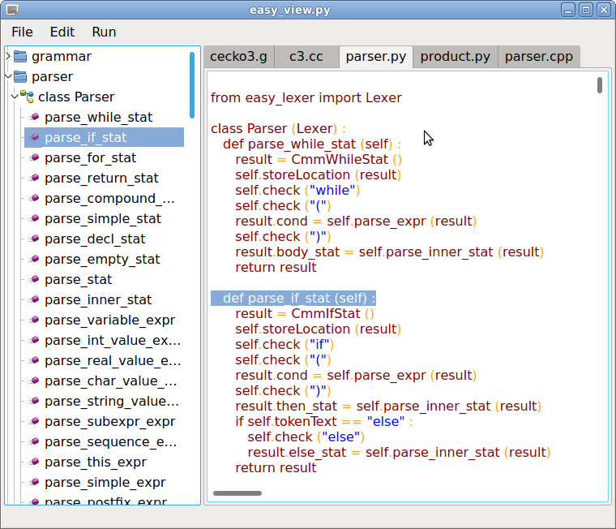
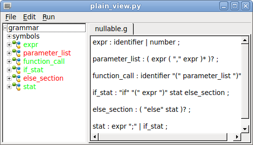
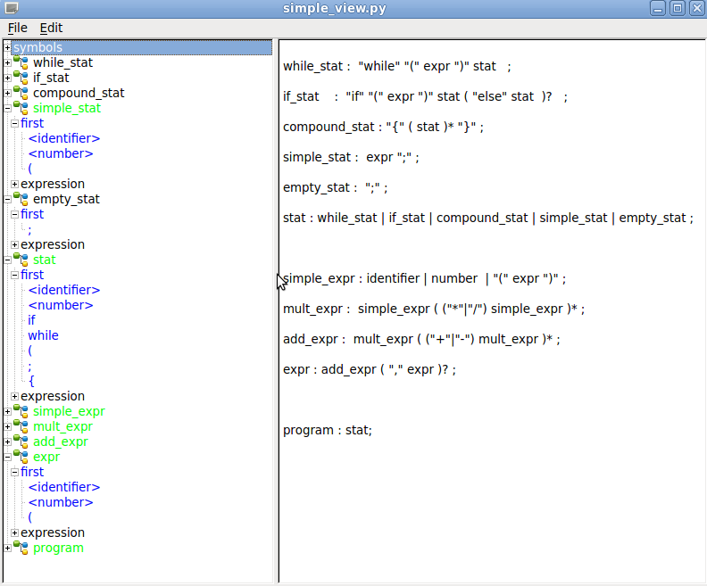
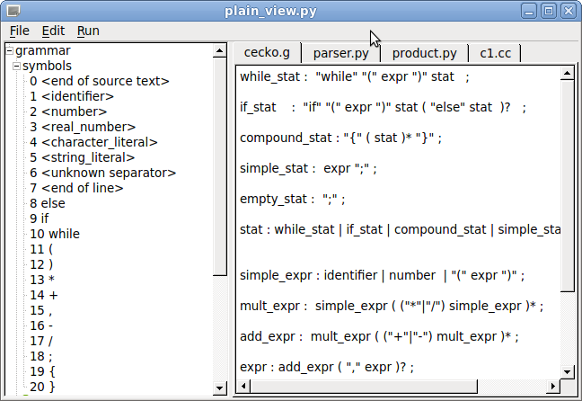
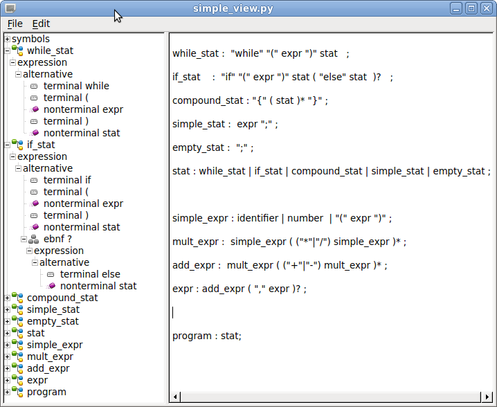

# easy-grammar
Parser generator written in Python 

## Simple C grammar

[input/cecko3.g](input/cecko3.g)

```antlr
if_stat < TIfStat: TStat >  :
   "if"
   "(" cond:expr ")"
   then_code:inner_stat
   (
      <new_line>
      "else"
      else_code:inner_stat
   )?   ;
```

## Generated parser

[output/cecko3_parser.py](output/cecko3_parser.py)

```python
   def parse_if_stat (self) :
      result = TIfStat ()
      self.storeLocation (result)
      self.check ("if")
      self.check ("(")
      result.cond = self.parse_expr ()
      self.check (")")
      result.then_code = self.parse_inner_stat ()
      if self.tokenText == "else" :
         self.check ("else")
         result.else_code = self.parse_inner_stat ()
      return result
```

## Generated class

Class **TIfStat** stores **if** statement data.

```python
class TIfStat (TStat) :
   def __init__ (self) :
      super (TIfStat, self).__init__ ()
      self.cond = None
      self.then_code = None
      self.else_code = None
```

## Generated product prints original source

[output/cecko3_pproduct.py](output/cecko3_product.py)

```python
class Product (Output) :

   def send_if_stat (self, param) :
      self.send ("if")
      self.send ("(")
      self.send_expr (param.cond)
      self.send (")")
      self.send_inner_stat (param.then_code)
      if param.else_code != None :
         self.style_new_line ()
         self.send ("else")
         self.send_inner_stat (param.else_code)
```

## Select (sub classes)

```antlr
stat < select TStat > :
   while_stat | if_stat | compound_stat | simple_stat | empty_stat ;
```

```python
   def parse_stat (self) :
      if self.tokenText == "while" :
         result = self.parse_while_stat ()
      elif self.tokenText == "if" :
         result = self.parse_if_stat ()
      elif self.tokenText == "{" :
         result = self.parse_compound_stat ()
      elif self.token == self.identifier or self.token == self.number or self.tokenText == "(" :
         result = self.parse_simple_stat ()
      elif self.tokenText == ";" :
         result = self.parse_empty_stat ()
      else :
         self.error ("Unexpected token")
      return result
```

```python
   def send_stat (self, param) :
      if isinstance (param, TWhileStat) :
         self.send_while_stat (param)
      elif isinstance (param, TIfStat) :
         self.send_if_stat (param)
      elif isinstance (param, TCompoundStat) :
         self.send_compound_stat (param)
      elif isinstance (param, TSimpleStat) :
         self.send_simple_stat (param)
      elif isinstance (param, TEmptyStat) :
         self.send_empty_stat (param)
```

```python
   class TSTat :
     pass

   class TWhileStat (TStat) :
      def __init__ (self) :
        super (TWhileStat, self).__init__ ()
        self.cond = None
        self.code = None
```

## Choose

```antlr
multiplicative_expr <choose CmmExpr>:
  unary_expr
  (
     <new CmmMulExpr:CmmBinaryExpr>
     <store left:CmmExpr>
     ( '*' <set kind=mulExp> |
       '/' <set kind=divExp> |
       '%' <set kind=modExp> )
     right:unary_expr
  )* ;

additive_expr <choose CmmExpr>:
  multiplicative_expr
  (
     <new CmmAddExpr:CmmBinaryExpr>
     <store left:CmmExpr>
     ( '+' <set kind=addExp> |
       '-' <set kind=subExp> )
     right:multiplicative_expr
  )* ;
```

```python
   def parse_multiplicative_expr (self) :
      result = self.parse_unary_expr ()
      while self.tokenText == "%" or self.tokenText == "*" or self.tokenText == "/" :
         store = result
         result = CmmMulExpr ()
         self.storeLocation (result)
         result.left = store
         if self.tokenText == "*" :
            self.check ("*")
            result.kind = result.mulExp
         elif self.tokenText == "/" :
            self.check ("/")
            result.kind = result.divExp
         elif self.tokenText == "%" :
            self.check ("%")
            result.kind = result.modExp
         else :
            self.error ("Unexpected token")
         result.right = self.parse_unary_expr ()
      return result
```

```python
   def send_multiplicative_expr (self, param) :
      if isinstance (param, CmmMulExpr) :
         self.send_multiplicative_expr (param.left)
         if param.kind == param.mulExp :
            self.send ("*")
         elif param.kind == param.divExp :
            self.send ("/")
         elif param.kind == param.modExp :
            self.send ("%")
         self.send_unary_expr (param.right)
      else :
         self.send_unary_expr (param)
```

## Lout diagrams

```
   if_stat  :  "if" "(" expr ")" stat ( "else" stat  )? ;
```
https://en.wikipedia.org/wiki/Lout_(software)

```
@SyntaxDiag
title {if_stat}
{
   @StartRight
   @Sequence
   A {blue @Color @BCell "if"}
   B {blue @Color @BCell "("}
   C {@ACell "expr"}
   D {blue @Color @BCell ")"}
   E {@ACell "stat"}
   F {@Optional
         @Sequence
         A {blue @Color @BCell "else"}
         B {@ACell "stat"}
   }
}
```



[output/cecko3.pdf](output/cecko3.pdf)

## Program easy_view.py



### Nullable rules



### First symbols



### Lexical symbols



### Grammar internal representation



