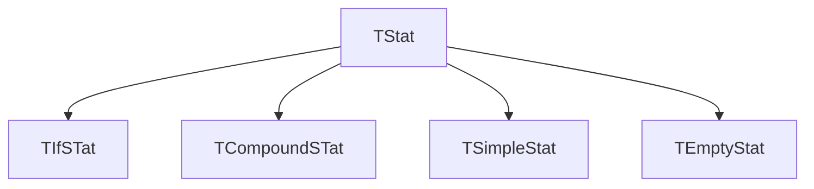

# easy-grammar
Parser generator written in Python 

Simple C grammar
================

[input/cecko3.g](input/cecko3.g)

```
if_stat < TIfStat: TStat >  :
   "if"
   "(" cond:expr ")"
   then_code:inner_stat
   (
      <new_line>
      "else"
      else_code:inner_stat
   )?   ;
```

Generated parser stores data
============================

[output/cecko3_parser.py](output/cecko3_parser.py)

```python
   def parse_if_stat (self) :
      result = TIfStat ()
      self.storeLocation (result)
      self.check ("if")
      self.check ("(")
      result.cond = self.parse_expr ()
      self.check (")")
      result.then_code = self.parse_inner_stat ()
      if self.tokenText == "else" :
         self.check ("else")
         result.else_code = self.parse_inner_stat ()
      return result
```

Class TIfStat stores **if** statement data.

**cond** field stores expression

**then_code** and **else_code** fields store statements

```python
class TIfStat (TStat) :
   def __init__ (self) :
      super (TIfStat, self).__init__ ()
      self.cond = None
      self.then_code = None
      self.else_code = None
```

Generated product prints data
=============================

[output/cecko3_pproduct.py](output/cecko3_product.py)

```python
class Product (Output) :

   def send_if_stat (self, param) :
      self.send ("if")
      self.send ("(")
      self.send_expr (param.cond)
      self.send (")")
      self.send_inner_stat (param.then_code)
      if param.else_code != None :
         self.style_new_line ()
         self.send ("else")
         self.send_inner_stat (param.else_code)
```

Selection
=========

```
stat < select TStat > :
   while_stat | if_stat | compound_stat | simple_stat | empty_stat ;
```

```python
   def parse_stat (self) :
      if self.tokenText == "while" :
         result = self.parse_while_stat ()
      elif self.tokenText == "if" :
         result = self.parse_if_stat ()
      elif self.tokenText == "{" :
         result = self.parse_compound_stat ()
      elif self.token == self.identifier or self.token == self.number or self.tokenText == "(" :
         result = self.parse_simple_stat ()
      elif self.tokenText == ";" :
         result = self.parse_empty_stat ()
      else :
         self.error ("Unexpected token")
      return result
```

```python
   def send_stat (self, param) :
      if isinstance (param, TWhileStat) :
         self.send_while_stat (param)
      elif isinstance (param, TIfStat) :
         self.send_if_stat (param)
      elif isinstance (param, TCompoundStat) :
         self.send_compound_stat (param)
      elif isinstance (param, TSimpleStat) :
         self.send_simple_stat (param)
      elif isinstance (param, TEmptyStat) :
         self.send_empty_stat (param)
```

```python
   class TSTat :
     pass

   class TWhileStat (TStat) :
      def __init__ (self) :
        super (TWhileStat, self).__init__ ()
        self.cond = None
        self.code = None
```


